# azure-security-monitoring-lab – AZ-900 Hands-On Project

**Project Goal**: Demonstrate core Azure security, governance, networking, monitoring, and cost management concepts through a practical lab deployment.

**Key Achievements**:
- Deployed a secure virtual network with 2 Windows VMs and custom Network Security Groups (NSGs) restricting management access.
- Implemented Azure RBAC using scoped roles to enforce least-privilege principles.
- Applied Azure Policy to restrict VM sizes and regions.
- Integrated Azure Activity Logs and VM events into Log Analytics Workspace.
- Configured Microsoft Sentinel for security monitoring with basic KQL queries.
- Kept total lab cost low by monitoring usage and cleaning up resources promptly.

**Azure Services Used**:
- Virtual Machines
- Virtual Network
- Network Security Groups
- Microsoft Entra ID (RBAC)
- Azure Policy
- Log Analytics Workspace
- Microsoft Sentinel

## Lab Architecture Overview

Resource Group (SecureLabRG)
├── Virtual Network (SecureLabVNet)
│   └── Subnet (default)
├── VM1 (Standard_D4s_v3, 4 vCPUs, 16 GiB RAM, Windows Server)
├── VM2 (Standard_D4s_v3, 4 vCPUs, Windows Server)
├── Network Security Group (SecureLabNSG) → Restricts RDP to specific IP
├── Log Analytics Workspace (SecureLabLA)
└── Microsoft Sentinel (connected to SecureLabLA)

## Step-by-Step Implementation

### 1. Portal Sign-In and Resource Group Creation
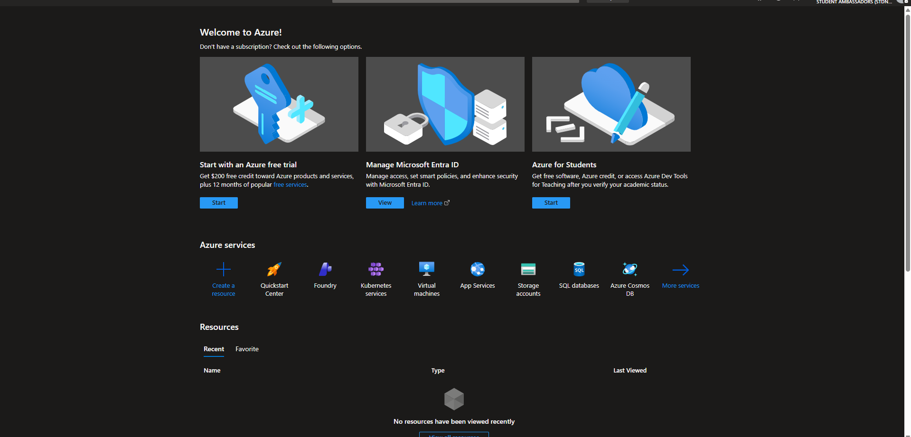
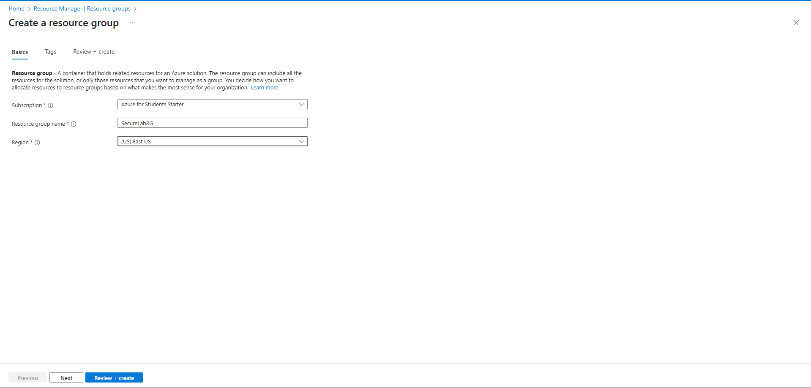

### 2. Virtual Network and Subnet Setup
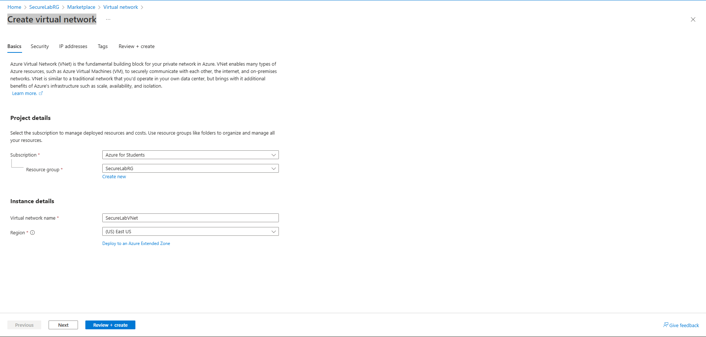
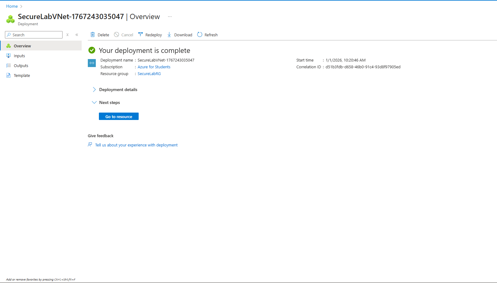

### 3. Deploying Virtual Machines

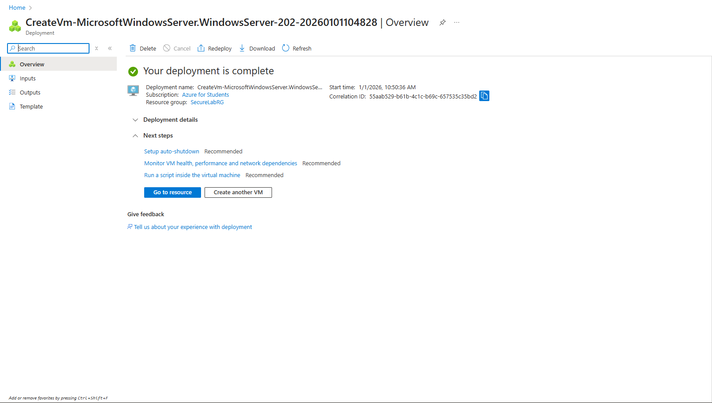
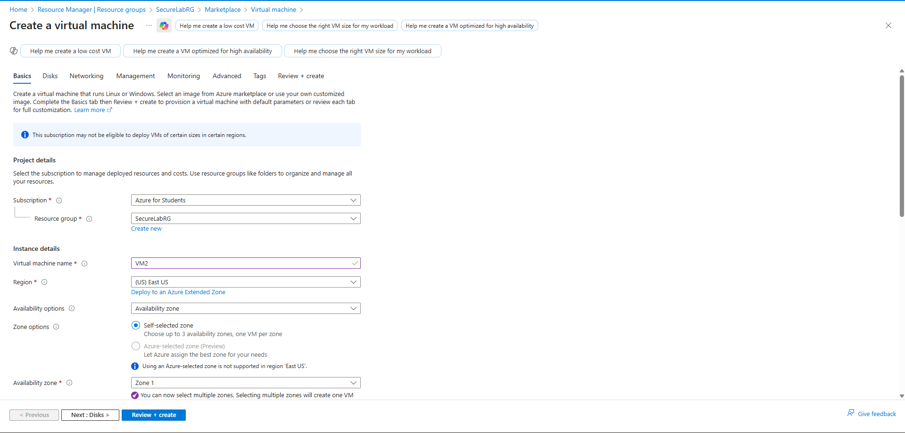

### 4. Network Security Group (Restricted RDP Access)
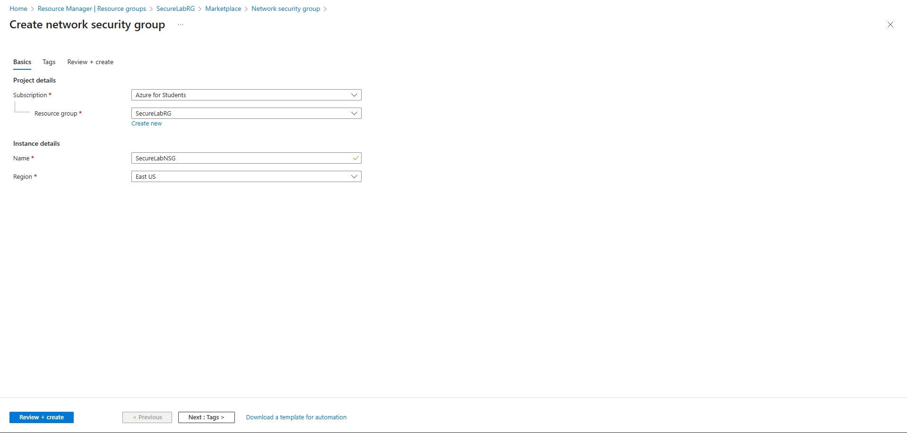
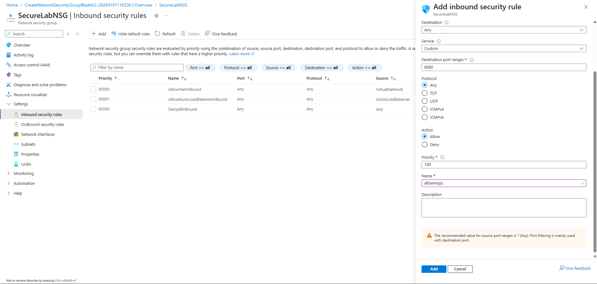

### 5. RDP Connectivity Test
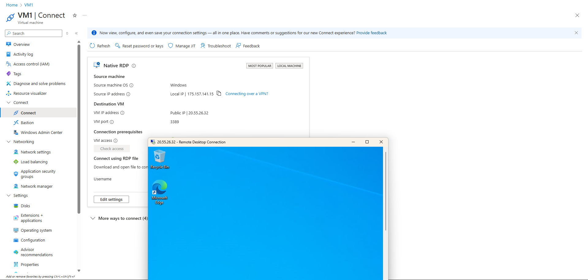

### 6. Role-Based Access Control (RBAC) – Scoped Least-Privilege
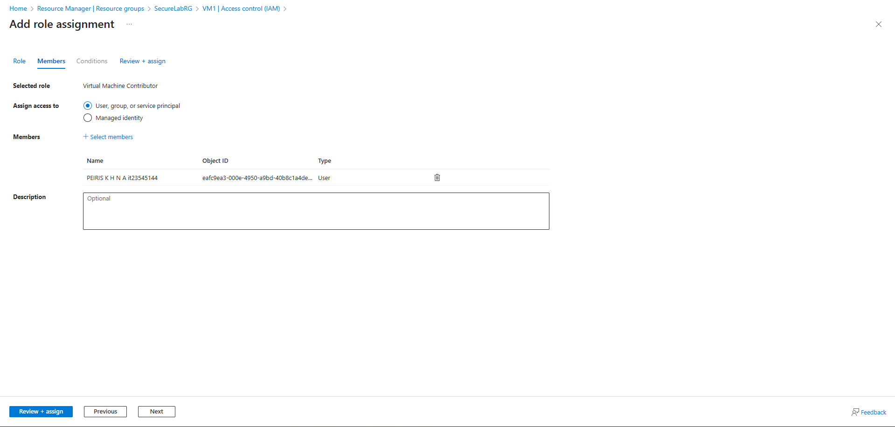
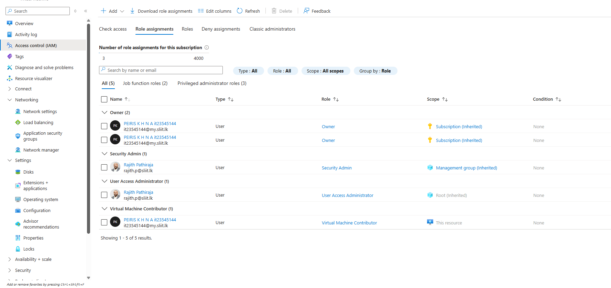

### 7. Azure Policy Enforcement
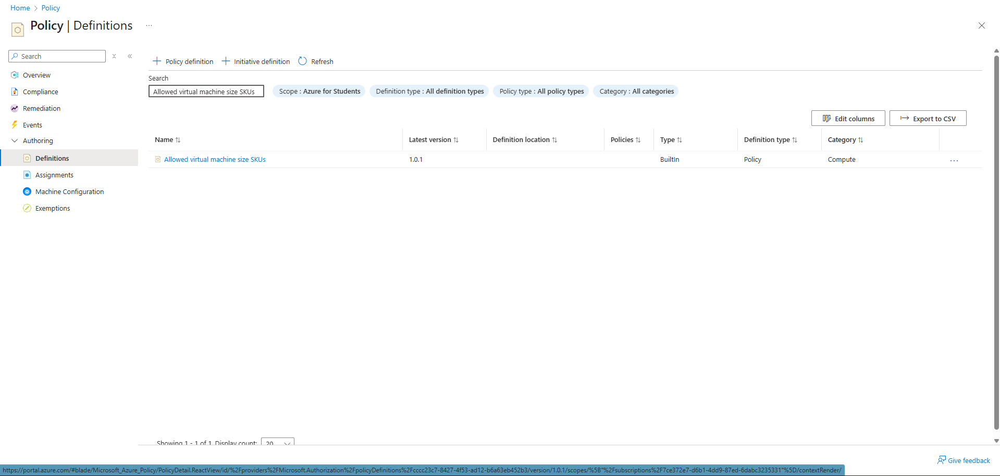
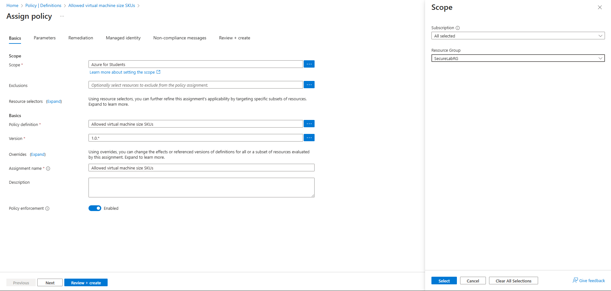
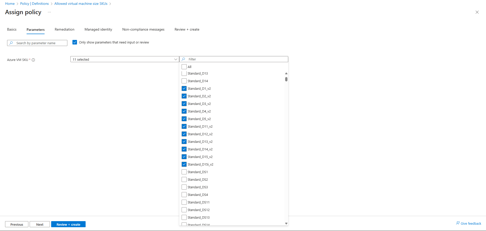
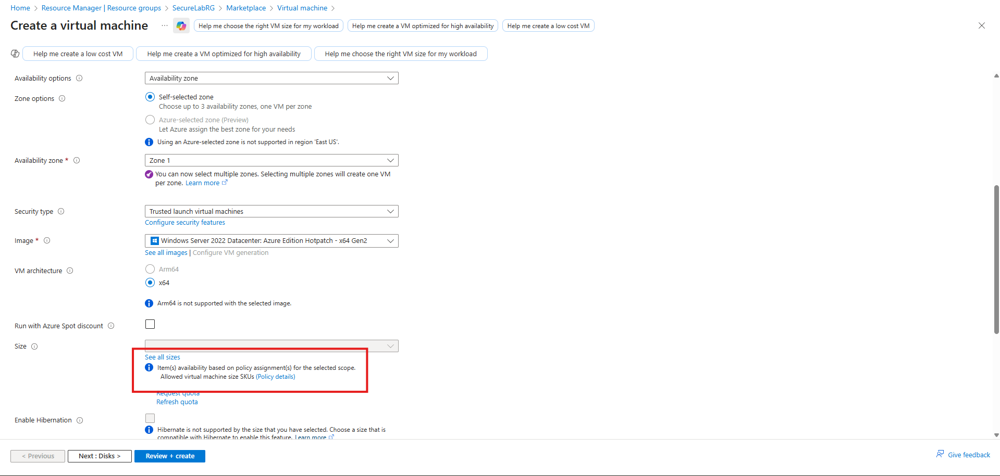

### 8. Log Analytics Workspace and Diagnostic Settings
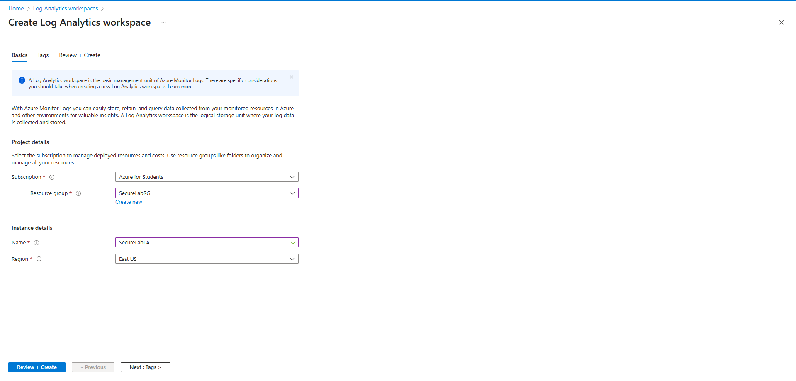
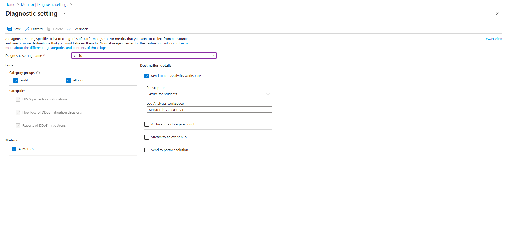

### 9. Microsoft Sentinel Configuration
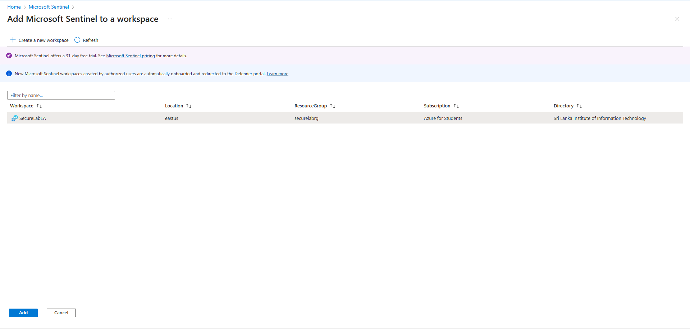

### 10. KQL Query Example in Sentinel (Security Event Investigation)

## Cost Management
- Used **Standard_D4s_v3** VMs (4 vCPUs, 16 GiB RAM) for better performance during lab exercises.
- Monitored costs regularly via Cost Management + Billing.
- Deallocated VMs when not in use and deleted the entire resource group at project completion to avoid ongoing charges.
- Leveraged free tiers for Log Analytics (first 5 GB/month) and Sentinel ingestion. with Azure free credits.

## Cleanup
All resources were deployed in a single resource group `SecureLabRG` and deleted at the end to avoid ongoing charges.

## Conclusion
This lab provided hands-on experience with Azure networking, identity, governance, monitoring, and security — directly aligning with AZ-900 certification objectives and real-world cloud security practices.

**Portfolio-ready proof of AZ-900 skills in security, compliance, and monitoring.**

---

*Repository maintained by [Nimesh Akalanka] – Azure enthusiast & AZ-900 certified.*
